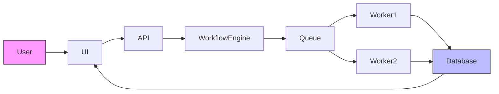

# FlowForge
> Distributed Workflow Orchestration Platform

## Overview
FlowForge is a developer-focused workflow orchestration platform that enables the definition and reliable execution of asynchronous workflows as Directed Acyclic Graphs (DAGs). It solves the complexity of managing dependent tasks in backend systems by providing a distributed architecture that handles task dependencies, retries, failure handling, scheduling, and observability. FlowForge is intended for developers building scalable applications that require coordinated task execution across distributed workers.

## The Problem
Managing asynchronous workflows manually becomes challenging as systems grow. Real backend systems often involve workflows with multiple dependent tasks, such as:
```
Task A → Task B → Task C → Task D
```
Reliable execution requires handling task dependencies, retries, failure handling, scheduling, execution tracking, distributed workers, and observability. Without a dedicated orchestration platform, implementing these concerns leads to complex, error-prone, and hard-to-maintain code.

## How FlowForge Works
FlowForge follows a clear lifecycle:
1. **Define Workflow**: Developers declare workflows as DAGs using code or configuration.
2. **Validate DAG**: The system checks for cycles and validates the workflow structure.
3. **Trigger Workflow**: Workflows can be started manually, via webhooks, or on a schedule.
4. **Create Execution**: An execution record is created to track the workflow run.
5. **Queue Tasks**: Tasks with no unresolved dependencies are queued for execution.
6. **Distributed Worker Executes Task**: Available workers pull tasks from the queue and execute them.
7. **Update Task State**: After execution, the task state (success, failure, retry) is updated.
8. **Retry / Fail / Continue**: Failed tasks are retried with exponential backoff; persistent failures move to a dead-letter queue.
9. **Execute Dependent Tasks**: Successful tasks unlock their dependent tasks for queuing.
10. **Workflow Completes**: When all tasks complete successfully, the workflow execution is marked as done.
11. **Monitor Execution in Real Time**: Users can monitor progress, logs, and metrics through the UI or API.

### Main Components
- **Workflow**: A declarative definition of a process as a DAG.
- **DAG**: Directed Acyclic Graph representing task dependencies.
- **Task**: A unit of work within a workflow.
- **Scheduler**: Responsible for triggering workflows based on schedules or events.
- **Queue**: Holds tasks ready for execution.
- **Worker**: Distributed processes that execute tasks.
- **Execution**: A specific run of a workflow.
- **State**: Tracks the status of tasks and workflows (pending, running, success, failed).
- **Logs**: Detailed output from task executions.
- **Real-time Monitoring**: Live view of workflow progress and system health.

## Key Features
* DAG-based workflow definition
* Workflow UI and API
* Manual, webhook, and scheduled triggers
* Task dependency management
* Distributed task execution
* Automatic retries with exponential backoff
* Task timeout and cancellation
* Execution history
* Per-task logs
* Real-time execution monitoring
* Idempotent task execution
* Dead-letter queue for failed tasks
* Rate limiting
* Structured audit logs
* Prometheus metrics

## Example Workflow
Consider a simple data processing workflow:
```text
Generate Report
       ↓
Upload Report
       ↓
Send Email
       ↓
Notify Team
```
FlowForge ensures that each task runs only after its dependencies are satisfied. For instance, "Upload Report" waits for "Generate Report" to complete successfully, and "Send Email" waits for both "Generate Report" and "Upload Report". The dispatcher assigns ready tasks to available workers, enabling parallel execution where dependencies allow.

## High-Level Architecture

This diagram illustrates the flow: Users interact via UI or API, which communicates with the Workflow Engine. The engine manages task queuning and distribution to workers. Workers update the database with task results and state, which feeds back to the UI for real-time monitoring.

## Why FlowForge?
Building FlowForge explores core concepts in distributed systems:
* Workflow orchestration patterns
* Queue-based task distribution
* DAG scheduling and topological sorting
* State management for fault tolerance
* Retry mechanisms with backoff
* Idempotency for safe retries
* Failure recovery and dead-letter handling
* Observability through logs and metrics
* Horizontal scaling of worker nodes
It serves as a practical foundation for understanding and implementing reliable, scalable workflow systems.