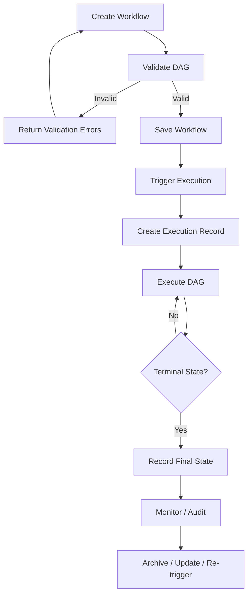

# FlowForge — Product Requirements Document (PRD)

> **Status:** Draft → Pending Review
> **Version:** 0.1
> **Source of Truth:** Task 01 — Pre-Development Planning
> **Parent Document:** `docs/01-pre-development-planning.md`

---

## 1. Product Overview

### 1.1 Product Name

**FlowForge** — Distributed Workflow Orchestration Platform

### 1.2 Product Description

A developer-focused platform for defining, executing, and monitoring reliable asynchronous workflows as directed acyclic graphs (DAGs) across distributed workers.

### 1.3 Product Purpose

FlowForge exists to eliminate the burden of building reliable orchestration infrastructure from scratch. Developers define *what* their workflows do; FlowForge handles *how* they run reliably — across failures, restarts, and distributed infrastructure.

### 1.4 Target Users

| User Type           | Role                                                                    |
| ------------------- | ----------------------------------------------------------------------- |
| **Primary**   | Backend Developers, Full-Stack Developers, DevOps/Platform Engineers    |
| **Secondary** | Technical Leads / Architects, Developers Evaluating Orchestration Tools |

*(Defined in Task 01, §4 — Target Users)*

### 1.5 Core Value Proposition

> **Focus on business logic. Let FlowForge handle the reliability.**

FlowForge provides battle-tested orchestration primitives — retries, scheduling, timeouts, failure recovery, and observability — so developers do not have to build them from scratch.

*(Aligned with Task 01, §8 — Value Proposition)*

---

## 2. Product Goals

### 2.1 Primary Goals

| #               | Goal                        | Definition of Success                                                                                                                                     |
| --------------- | --------------------------- | --------------------------------------------------------------------------------------------------------------------------------------------------------- |
| **PG-01** | Reliable Workflow Execution | Every triggered workflow executes to a defined terminal state (success, failure, or cancelled) without silent data loss or orphaned tasks.                |
| **PG-02** | Observable Operations       | Every significant event in a workflow's lifecycle (start, task completion, retry, timeout, failure, cancellation) is visible and inspectable by the user. |
| **PG-03** | Fault Tolerance             | Transient failures (network timeouts, temporary service unavailability) are handled automatically by the platform according to configurable policies.     |
| **PG-04** | Developer Ergonomics        | A developer unfamiliar with FlowForge can define and execute a working workflow within 30 minutes of reading the documentation.                           |
| **PG-05** | Distributed Execution       | Multiple workers can execute tasks concurrently, with work distributed across worker instances without manual coordination.                               |

### 2.2 Secondary Goals

| #               | Goal                          | Definition of Success                                                                                                                   |
| --------------- | ----------------------------- | --------------------------------------------------------------------------------------------------------------------------------------- |
| **SG-01** | Structured Auditability       | All workflow lifecycle events are recorded in a structured, queryable log for post-mortem analysis and compliance.                      |
| **SG-02** | Prometheus-Compatible Metrics | The system exposes operational metrics (workflow throughput, task latency, error rates, queue depth) in a Prometheus-compatible format. |
| **SG-03** | Workflow Versioning           | Workflow definitions can be versioned so that execution history remains associated with the correct definition version.                 |
| **SG-04** | Dead-Letter Handling          | Tasks that exhaust all retry attempts are routed to a dead-letter destination, not silently dropped.                                    |
| **SG-05** | Rate Limiting                 | The system supports rate limiting at the task or workflow level to prevent overloading external services.                               |

*(Primary and secondary goals derived from Task 01, §6 — Product Goals)*

---

## 3. Product Non-Goals

The following non-goals are carried forward from Task 01 (§7). They shall not be introduced as requirements without explicit approval to modify this document.

| Non-Goal                                                                                                                          | Source      |
| --------------------------------------------------------------------------------------------------------------------------------- | ----------- |
| **A full CI/CD platform** — FlowForge is not Jenkins or GitHub Actions.                                                    | Task 01 §7 |
| **A streaming/real-time data platform** — FlowForge operates on discrete workflow executions, not unbounded event streams. | Task 01 §7 |
| **A managed cloud service** — FlowForge targets self-hosted deployment.                                                    | Task 01 §7 |
| **A multi-tenant enterprise platform** — Fine-grained multi-tenant isolation is a future consideration.                    | Task 01 §7 |
| **A workflow visual designer / no-code tool** — Workflows are defined programmatically or via structured configuration.    | Task 01 §7 |
| **A replacement for message brokers** — FlowForge consumes from queues but does not replace queue infrastructure.          | Task 01 §7 |

---

## 4. User Personas

### 4.1 Primary Personas

---

#### Persona 1: The Backend Developer — Arjun

| Field                          | Description                                                                                                                                                        |
| ------------------------------ | ------------------------------------------------------------------------------------------------------------------------------------------------------------------ |
| **Role**                 | Backend Developer at a mid-sized SaaS company                                                                                                                      |
| **Goals**                | Ship reliable background features (email notifications, report generation, data exports) without blocking HTTP requests or building custom retry/scheduling logic. |
| **Problems**             | Currently uses a mix of cron jobs and database polling scripts that are fragile, hard to test, and impossible to observe when something goes wrong at 2 AM.        |
| **Needs from FlowForge** | Define workflows programmatically, trigger them from code or webhooks, and get a clear dashboard showing which tasks ran and which failed — with logs.            |
| **Typical Interactions** | Writes workflow definition → deploys it → triggers via API call → monitors execution in a dashboard or via CLI.                                                 |
| **Success Metric**       | Can onboard a new workflow without filing a Jira ticket or waiting for DevOps.                                                                                     |

---

#### Persona 2: The Platform Engineer — Priya

| Field                          | Description                                                                                                                               |
| ------------------------------ | ----------------------------------------------------------------------------------------------------------------------------------------- |
| **Role**                 | Platform Engineer supporting 5–10 application teams                                                                                      |
| **Goals**                | Provide a self-service workflow orchestration layer so teams can run background jobs without needing dedicated infrastructure expertise.  |
| **Problems**             | Each team builds its own cron+database solution, creating fragmented, unmaintainable tooling and no shared observability.                 |
| **Needs from FlowForge** | A single platform teams can self-onboard to, with clear APIs, structured logging, and multi-team isolation at the workflow level.         |
| **Typical Interactions** | Installs/configures FlowForge → creates tenant-level configurations → monitors cluster health → assists teams with workflow debugging. |
| **Success Metric**       | Teams can onboard a new workflow without involving the platform team after initial setup.                                                 |

---

#### Persona 3: The Full-Stack Developer — Sam

| Field                          | Description                                                                                                                   |
| ------------------------------ | ----------------------------------------------------------------------------------------------------------------------------- |
| **Role**                 | Full-Stack Developer building a consumer app                                                                                  |
| **Goals**                | Run background tasks (image processing, email confirmations, analytics aggregation) without blocking the user-facing request. |
| **Problems**             | Cannot afford the operational overhead of Airflow. Needs something that runs on a single VPS without Kubernetes.              |
| **Needs from FlowForge** | Simple workflow definition, runs locally for development, deploys to the same VPS in production.                              |
| **Typical Interactions** | Defines workflows locally → tests them via CLI → deploys to a single server.                                                |
| **Success Metric**       | Same workflow definition works locally and in production with no code changes.                                                |

---

### 4.2 Secondary Personas

---

#### Persona 4: Technical Lead — Director of Engineering

| Field                          | Description                                                                                                                  |
| ------------------------------ | ---------------------------------------------------------------------------------------------------------------------------- |
| **Role**                 | Technical Lead evaluating FlowForge for team adoption                                                                        |
| **Goals**                | Assess reliability, scalability, operational footprint, and team learning curve before committing.                           |
| **Problems**             | Needs to compare FlowForge against alternatives (Temporal, Airflow, homegrown) with concrete evidence, not marketing claims. |
| **Needs from FlowForge** | Clear documentation of architecture, failure modes, failure recovery behavior, and operational requirements.                 |
| **Typical Interactions** | Reads architecture documentation → reviews failure scenarios → runs a proof-of-concept → presents findings to the team.   |

---

#### Persona 5: Hiring Manager / Interviewer

| Field                          | Description                                                                                                               |
| ------------------------------ | ------------------------------------------------------------------------------------------------------------------------- |
| **Role**                 | Hiring manager evaluating candidates or interviewer assessing technical depth                                             |
| **Goals**                | Evaluate whether a candidate's "FlowForge" project demonstrates genuine distributed-systems competency.                   |
| **Needs from FlowForge** | A coherent, well-documented project that tells a clear story: problem, design decisions, trade-offs, and implementation.  |
| **Typical Interactions** | Reviews GitHub README → reads architecture docs → reviews code structure → discusses failure scenarios and trade-offs. |

---

## 5. Core Product Capabilities

### 5.1 Workflow Management

| Capability                          | Description                                                                                                                                                                 |
| ----------------------------------- | --------------------------------------------------------------------------------------------------------------------------------------------------------------------------- |
| **Create Workflow**           | Users can define a new workflow with a unique identifier, metadata (name, description, version), and a DAG structure.                                                       |
| **View Workflow**             | Users can retrieve a workflow definition by its identifier, including its task graph and configuration.                                                                     |
| **Update Workflow**           | Users can replace a workflow definition. Versioning ensures historical executions remain associated with the correct definition.                                            |
| **Delete / Archive Workflow** | Users can archive a workflow (soft delete) to prevent new executions while preserving history. Hard deletion may be restricted to prevent breaking audit trails.            |
| **Workflow Validation**       | Before saving, the system validates that the workflow definition is structurally valid: no cycles in the DAG, all referenced task types exist, required fields are present. |

### 5.2 DAG Definition

| Capability                             | Description                                                                                                                                                               |
| -------------------------------------- | ------------------------------------------------------------------------------------------------------------------------------------------------------------------------- |
| **Define Tasks**                 | A workflow consists of one or more tasks. Each task has a unique identifier within the workflow, a task type, input parameters, and per-task retry/timeout configuration. |
| **Define Dependencies**          | Tasks declare explicit dependencies on other tasks. A task may not execute until all of its declared dependencies have completed successfully.                            |
| **Validate DAG**                 | The system enforces that the workflow graph is a valid DAG (no cycles). Cyclic dependencies must be rejected at validation time.                                          |
| **Represent Workflow Structure** | The workflow structure must be serializable and storable (e.g., JSON, YAML, or a structured configuration format).                                                        |

### 5.3 Workflow Triggers

| Capability                         | Description                                                                                                                                                                      |
| ---------------------------------- | -------------------------------------------------------------------------------------------------------------------------------------------------------------------------------- |
| **Manual Trigger**           | Users can trigger a workflow execution immediately via an API call or CLI command, passing input parameters.                                                                     |
| **HTTP / Webhook Trigger**   | The system exposes an HTTP endpoint that accepts webhook payloads to trigger workflow executions.                                                                                |
| **Scheduled / Cron Trigger** | Users can attach a cron schedule to a workflow. The system triggers the workflow automatically at the configured times. Multiple schedules may be attached to a single workflow. |

### 5.4 Workflow Execution

| Capability                                  | Description                                                                                                                                  |
| ------------------------------------------- | -------------------------------------------------------------------------------------------------------------------------------------------- |
| **Create Execution**                  | Triggering a workflow creates an execution record with a unique execution ID, linked to the workflow definition and version.                 |
| **Execute According to Dependencies** | Tasks execute only when all upstream dependencies have completed successfully. Tasks without dependencies execute immediately.               |
| **Sequential Execution**              | When a task depends on another, execution waits for the dependency to complete before starting.                                              |
| **Parallel Execution**                | Tasks with no mutual dependencies execute concurrently, maximizing throughput.                                                               |
| **Track Execution State**             | The system tracks the real-time state of every execution and every task within it (pending, running, succeeded, failed, skipped, cancelled). |

### 5.5 Reliability

| Capability                         | Description                                                                                                                         |
| ---------------------------------- | ----------------------------------------------------------------------------------------------------------------------------------- |
| **Retry Failed Tasks**       | Tasks that fail may be automatically retried according to a configurable retry policy.                                              |
| **Backoff Between Attempts** | Retries use configurable backoff intervals (e.g., exponential backoff with jitter) to avoid thundering-herd problems.               |
| **Handle Task Failures**     | When a task fails after exhausting its retry attempts, the system records the failure, logs the error, and surfaces it to the user. |
| **Task Timeout**             | Tasks that exceed a configurable time limit are terminated and treated as failed.                                                   |
| **Cancellation**             | Users can cancel a running execution. In-flight tasks receive a cancellation signal and can shut down gracefully.                   |

> **Note:** The specific retry algorithm, backoff formula, and state machine are implementation details — specified in later tasks (Tasks 13 and 09).

### 5.6 Execution Monitoring

| Capability                               | Description                                                                                                                          |
| ---------------------------------------- | ------------------------------------------------------------------------------------------------------------------------------------ |
| **Execution History**              | Users can retrieve the complete list of executions for a workflow, including status, start time, end time, and triggering mechanism. |
| **Workflow Execution Status**      | Users can query the current state of any execution (pending, running, succeeded, failed, cancelled).                                 |
| **Task-Level Status**              | Users can see the individual status of every task within an execution.                                                               |
| **Task-Level Logs**                | Each task produces logs. Users can retrieve logs for any task execution, including from failed and retried attempts.                 |
| **Real-Time Execution Visibility** | Users can observe execution progress in real time — which tasks are running, which are pending, and which have completed.           |

### 5.7 Distributed Execution

| Capability                          | Description                                                                                                                    |
| ----------------------------------- | ------------------------------------------------------------------------------------------------------------------------------ |
| **Distributed Workers**       | Tasks are executed by workers. Multiple worker instances can run concurrently, each processing tasks from a shared work queue. |
| **Multiple Worker Instances** | The system supports running more than one worker simultaneously without manual coordination between workers.                   |

> **Note:** Worker coordination mechanisms, queue technology, and worker discovery are implementation details — specified in later tasks (Tasks 15 and 16).

### 5.8 Advanced Capabilities

The following capabilities extend the core feature set. They are listed here for completeness; see §10 for MVP scope decisions.

| Capability                      | Description                                                                                                                                                  | Phase    |
| ------------------------------- | ------------------------------------------------------------------------------------------------------------------------------------------------------------ | -------- |
| **Idempotency**           | Tasks are safe to retry without causing duplicate side effects. The system supports idempotency keys to detect and deduplicate duplicate executions.         | Core     |
| **Dead-Letter Queue**     | Tasks that fail after exhausting all retry attempts are routed to a dead-letter destination (a queue or log) for later inspection or manual replay.          | Core     |
| **Rate Limiting**         | The system enforces per-task or per-workflow rate limits to prevent overwhelming external services.                                                          | Advanced |
| **Structured Audit Logs** | All workflow lifecycle events are recorded in a structured, machine-readable log format (JSON) for analysis and compliance.                                  | Core     |
| **Prometheus Metrics**    | The system exposes operational metrics in Prometheus format: workflow throughput, task latency, error rates, queue depth, retry counts.                      | Advanced |
| **Workflow Versioning**   | Workflow definitions are versioned. Running executions retain a reference to the definition version they were created with, ensuring reproducible execution. | Advanced |

---

## 6. Functional Requirements

### 6.1 Workflow Management (FR-WF-*)

| ID                  | Requirement       | Description                                                                                                                                                       | Priority | Acceptance Criteria                                                                                                                                   |
| ------------------- | ----------------- | ----------------------------------------------------------------------------------------------------------------------------------------------------------------- | -------- | ----------------------------------------------------------------------------------------------------------------------------------------------------- |
| **FR-WF-001** | Create Workflow   | Users can create a new workflow by submitting a valid workflow definition with a unique identifier.                                                               | P0       | A workflow definition with a unique ID can be submitted and stored. Attempting to create a workflow with a duplicate ID returns an appropriate error. |
| **FR-WF-002** | Retrieve Workflow | Users can retrieve a stored workflow definition by its identifier.                                                                                                | P0       | Given a valid workflow ID, the complete workflow definition (tasks, dependencies, metadata) is returned.                                              |
| **FR-WF-003** | Update Workflow   | Users can update a workflow definition. The update creates a new version; historical executions remain associated with their original version.                    | P1       | Updating a workflow creates a new version without breaking in-flight executions.                                                                      |
| **FR-WF-004** | Archive Workflow  | Users can archive a workflow, preventing new executions from being created while preserving history.                                                              | P1       | Archived workflows cannot be triggered. Historical executions remain accessible.                                                                      |
| **FR-WF-005** | Validate Workflow | The system validates workflow definitions before saving. Validation checks include: valid DAG (no cycles), all task types exist, all required fields are present. | P0       | An invalid DAG (cycle) is rejected with a clear error message identifying the cycle.                                                                  |
| **FR-WF-006** | List Workflows    | Users can list all registered workflows with optional filters (status, created date).                                                                             | P1       | The list operation returns workflow metadata without full definitions. Pagination is supported.                                                       |

### 6.2 Task Definition (FR-TASK-*)

| ID                    | Requirement         | Description                                                                                                                       | Priority | Acceptance Criteria                                                                                        |
| --------------------- | ------------------- | --------------------------------------------------------------------------------------------------------------------------------- | -------- | ---------------------------------------------------------------------------------------------------------- |
| **FR-TASK-001** | Define Task         | A task is defined with: a unique ID within the workflow, a task type, input parameters, and per-task retry/timeout configuration. | P0       | A task with a valid type and parameters is accepted. An invalid task type is rejected at validation time.  |
| **FR-TASK-002** | Define Dependencies | Tasks can declare dependencies on other tasks by referencing the dependent task's ID.                                             | P0       | A task with an unresolved dependency reference is rejected at validation time.                             |
| **FR-TASK-003** | Task Type Registry  | The system maintains a registry of available task types.                                                                          | P0       | Users can discover which task types are available. Unknown task types are rejected at workflow validation. |

### 6.3 Triggers (FR-TRIGGER-*)

| ID                       | Requirement              | Description                                                                                                   | Priority | Acceptance Criteria                                                                                                         |
| ------------------------ | ------------------------ | ------------------------------------------------------------------------------------------------------------- | -------- | --------------------------------------------------------------------------------------------------------------------------- |
| **FR-TRIGGER-001** | Manual Trigger           | Users can trigger a workflow execution immediately via API or CLI, passing input parameters.                  | P0       | A workflow can be triggered with arbitrary input parameters. The trigger returns an execution ID.                           |
| **FR-TRIGGER-002** | HTTP/Webhook Trigger     | The system exposes an HTTP endpoint that triggers a workflow when called.                                     | P1       | An HTTP POST to the webhook endpoint creates an execution. Invalid payloads return appropriate HTTP error codes.            |
| **FR-TRIGGER-003** | Cron Schedule Trigger    | Users can attach a cron schedule to a workflow. The system triggers it automatically at the configured times. | P1       | A scheduled workflow executes at the configured time without manual intervention. Schedules persist across server restarts. |
| **FR-TRIGGER-004** | Trigger Input Parameters | All trigger types accept input parameters that are passed to the workflow's initial tasks.                    | P0       | Input parameters from any trigger source are passed correctly to the workflow's entry-point tasks.                          |

### 6.4 Execution (FR-EXEC-*)

| ID                    | Requirement                 | Description                                                                                                                | Priority | Acceptance Criteria                                                                                                    |
| --------------------- | --------------------------- | -------------------------------------------------------------------------------------------------------------------------- | -------- | ---------------------------------------------------------------------------------------------------------------------- |
| **FR-EXEC-001** | Create Execution            | Triggering a workflow creates an execution record with a unique execution ID.                                              | P0       | Every trigger creates a distinct execution record with a unique ID.                                                    |
| **FR-EXEC-002** | Dependency-Aware Scheduling | Tasks are dispatched for execution only when all upstream dependencies have succeeded.                                     | P0       | A task with an unresolved dependency does not start. Tasks with satisfied dependencies start within a reasonable time. |
| **FR-EXEC-003** | Parallel Execution          | Tasks with no mutual dependencies execute concurrently.                                                                    | P0       | Two tasks with no dependencies on each other (or on shared tasks) can run simultaneously on different workers.         |
| **FR-EXEC-004** | Execution State Tracking    | Every execution and task maintains a visible state (pending, running, succeeded, failed, skipped, cancelled).              | P0       | At any time, a user can query the system and determine the current state of any execution or task.                     |
| **FR-EXEC-005** | Execution Completion        | An execution reaches a terminal state (success, failure, cancelled) when all reachable tasks have reached terminal states. | P0       | An execution does not appear "running" when all tasks are in terminal states.                                          |

### 6.5 Reliability (FR-RETRY-*)

| ID                     | Requirement               | Description                                                                                                         | Priority | Acceptance Criteria                                                                                                                     |
| ---------------------- | ------------------------- | ------------------------------------------------------------------------------------------------------------------- | -------- | --------------------------------------------------------------------------------------------------------------------------------------- |
| **FR-RETRY-001** | Configurable Retry Policy | Each task (or the workflow) can specify: maximum retry count, backoff strategy, and retryable error types.          | P0       | A task with`max_retries: 3` is retried up to 3 times after failure before the failure is final.                                       |
| **FR-RETRY-002** | Exponential Backoff       | Retry intervals increase exponentially (with optional jitter) to avoid thundering-herd problems.                    | P0       | After a first failure, retries occur at increasing intervals. The backoff formula is documented and configurable.                       |
| **FR-RETRY-003** | Task Timeout              | Tasks that exceed a configurable time limit are terminated and marked as failed.                                    | P0       | A task with a 30-second timeout that runs for 60 seconds is terminated and marked as failed with a timeout error.                       |
| **FR-RETRY-004** | Task Cancellation         | Users can cancel a running execution. In-flight tasks receive a cancellation signal and shut down gracefully.       | P1       | After a cancel request, the execution transitions to cancelled state. Previously completed tasks are not re-run.                        |
| **FR-RETRY-005** | Dead-Letter Routing       | Tasks that fail after exhausting all retry attempts are routed to a dead-letter destination (not dropped silently). | P0       | A task that fails after 3 retries appears in the dead-letter destination with full context (task ID, workflow ID, execution ID, error). |

### 6.6 Monitoring & Observability (FR-MON-*)

| ID                   | Requirement             | Description                                                                                                                       | Priority | Acceptance Criteria                                                                                                                        |
| -------------------- | ----------------------- | --------------------------------------------------------------------------------------------------------------------------------- | -------- | ------------------------------------------------------------------------------------------------------------------------------------------ |
| **FR-MON-001** | Execution History       | Users can retrieve all executions for a workflow, with status, timestamps, and trigger source.                                    | P0       | A list of executions is returned with pagination. Each entry includes status, start time, end time, and trigger.                           |
| **FR-MON-002** | Task Logs               | Each task execution produces logs that are retrievable by execution ID and task ID.                                               | P0       | Logs for any task execution are retrievable, including logs from retried attempts.                                                         |
| **FR-MON-003** | Real-Time Status        | Users can observe the current state of a running execution in real time.                                                          | P0       | A running execution shows which tasks are pending, running, and completed at the moment of query.                                          |
| **FR-MON-004** | Structured Audit Logs   | Workflow lifecycle events (start, task events, retries, completions, failures) are written to a structured, machine-readable log. | P1       | Audit logs contain: event type, timestamp, execution ID, task ID, actor, and result. Logs are in JSON format.                              |
| **FR-MON-005** | Prometheus Metrics      | The system exposes metrics in Prometheus format.                                                                                  | P2       | Metrics include at minimum:`flowforge_workflow_executions_total`, `flowforge_task_duration_seconds`, `flowforge_task_retries_total`. |
| **FR-MON-006** | Execution Retry History | For each task, users can see how many times it was retried and why each attempt failed.                                           | P0       | Given a failed task, the user can view the error from each attempt (up to the max retry count).                                            |

### 6.7 Idempotency (FR-IDEM-*)

| ID                    | Requirement               | Description                                                                                                                                           | Priority | Acceptance Criteria                                                                                                    |
| --------------------- | ------------------------- | ----------------------------------------------------------------------------------------------------------------------------------------------------- | -------- | ---------------------------------------------------------------------------------------------------------------------- |
| **FR-IDEM-001** | Idempotency Keys          | Users can supply an idempotency key when triggering a workflow. The system ensures that duplicate triggers with the same key produce the same result. | P0       | Triggering a workflow with the same idempotency key twice returns the original execution without creating a duplicate. |
| **FR-IDEM-002** | Idempotent Task Execution | Tasks are safe to re-execute without causing duplicate side effects.                                                                                  | P0       | Re-running a task (via retry or re-trigger) does not produce duplicate side effects in external systems.               |

---

## 7. Workflow Product Lifecycle

The following describes the product-level lifecycle of a workflow from creation to archival.

### Stage Descriptions

| Stage                                   | Description                                                                                        | User Action                 | System Responsibility                                                  |
| --------------------------------------- | -------------------------------------------------------------------------------------------------- | --------------------------- | ---------------------------------------------------------------------- |
| **Create**                        | User defines a workflow: tasks, dependencies, metadata.                                            | Submits workflow definition | Assigns unique workflow ID                                             |
| **Validate**                      | System checks the definition for correctness: DAG validity, task types, required fields.           | —                          | Rejects invalid definitions with specific errors                       |
| **Save**                          | Valid workflow is persisted to the workflow store.                                                 | —                          | Stores definition, assigns version number                              |
| **Trigger**                       | An execution is initiated. Triggers may be manual, HTTP, or scheduled.                             | API call / webhook / cron   | Creates execution record, dispatches initial tasks                     |
| **Execute**                       | Workers pick up tasks and execute them. System tracks state transitions.                           | —                          | Manages task dispatch, dependency resolution, state transitions        |
| **Monitor**                       | User observes execution state, reviews logs, investigates failures.                                | Queries status, reads logs  | Provides real-time state, log retrieval, structured audit trail        |
| **Complete / Fail / Cancel**      | Execution reaches a terminal state.                                                                | —                          | Records final state, routes dead-letter tasks, fires completion events |
| **Review History**                | User reviews past executions, failure patterns, performance.                                       | Queries execution history   | Returns historical records with full context                           |
| **Archive / Update / Re-trigger** | User decides next action: archive the workflow, update its definition, or trigger a new execution. | Archival / update / trigger | Preserves history, manages versioning, creates new executions          |

---

## 8. User Journeys

### 8.1 Core Journeys

| #               | Journey                      | Summary                                                                                                                                                      |
| --------------- | ---------------------------- | ------------------------------------------------------------------------------------------------------------------------------------------------------------ |
| **UJ-01** | Create a Workflow            | User submits a valid workflow definition → system validates it → system stores it with a version.                                                          |
| **UJ-02** | Validate a Workflow          | User submits a workflow definition → system checks DAG validity, task types, required fields → system returns validation result (pass or specific errors). |
| **UJ-03** | Trigger a Workflow Manually  | User calls the trigger API with input parameters → system creates an execution record and dispatches initial tasks → system returns an execution ID.       |
| **UJ-04** | Trigger via Webhook          | An external system POSTs to the webhook endpoint → system creates an execution record → system returns a response.                                         |
| **UJ-05** | Schedule a Workflow          | User attaches a cron schedule to a workflow → system triggers the workflow automatically at the scheduled time.                                             |
| **UJ-06** | Monitor Execution            | User queries the execution status → system returns current task states, progress, and any errors.                                                           |
| **UJ-07** | Investigate a Failed Task    | User retrieves task logs and retry history → user identifies the root cause of the failure.                                                                 |
| **UJ-08** | Retry a Failed Task          | User requests a manual retry of a failed task → system re-executes the task with the same input.                                                            |
| **UJ-09** | Cancel an Execution          | User requests cancellation of a running execution → in-flight tasks receive cancellation signals → execution reaches a cancelled terminal state.           |
| **UJ-10** | Review Historical Executions | User lists past executions for a workflow → user retrieves details, logs, and failure context for any past execution.                                       |

### 7.2 Journey Notes

- **UJ-01 through UJ-05** cover the authoring and triggering lifecycle.
- **UJ-06 through UJ-10** cover the monitoring and operational lifecycle.
- Detailed UX flows (screen-by-screen, step-by-step) are out of scope for the PRD and will be addressed in Task 22 (UI/UX Specification).

---

## 9. Acceptance Criteria

The following acceptance criteria define when a capability is considered *done* from a user's perspective.

### 9.1 Workflow Management

| AC-WF-01 | A user can create a workflow with a unique ID and receive confirmation that it was stored successfully.     |
| -------- | ----------------------------------------------------------------------------------------------------------- |
| AC-WF-02 | A user can retrieve a workflow definition and see all tasks, dependencies, and metadata.                    |
| AC-WF-03 | A user submitting a workflow with a cyclic dependency receives a clear error message identifying the cycle. |
| AC-WF-04 | A user can update a workflow without disrupting in-flight executions of the previous version.               |

### 9.2 Execution

| AC-EXEC-01 | A triggered workflow creates a distinct execution record with a unique execution ID.                          |
| ---------- | ------------------------------------------------------------------------------------------------------------- |
| AC-EXEC-02 | Tasks execute only after all upstream dependencies have succeeded.                                            |
| AC-EXEC-03 | Two independent tasks in a workflow execute concurrently on separate workers.                                 |
| AC-EXEC-04 | An execution reaches a terminal state (success, failure, cancelled) and does not remain in a "running" state. |

### 9.3 Reliability

| AC-RETRY-01 | A task configured with 3 max retries is retried up to 3 times before being marked as permanently failed.           |
| ----------- | ------------------------------------------------------------------------------------------------------------------ |
| AC-RETRY-02 | Retries use increasing backoff intervals; they do not fire immediately after failure.                              |
| AC-RETRY-03 | A task that runs longer than its configured timeout is terminated and marked as failed.                            |
| AC-RETRY-04 | A cancelled execution terminates in-progress tasks and records a cancelled terminal state.                         |
| AC-RETRY-05 | A task that fails after exhausting all retries appears in the dead-letter destination with full execution context. |

### 9.4 Observability

| AC-MON-01 | A user can retrieve the current state of any running execution within one API call.                                   |
| --------- | --------------------------------------------------------------------------------------------------------------------- |
| AC-MON-02 | A user can retrieve logs for any task execution, including failed and retried attempts.                               |
| AC-MON-03 | A user can view the complete execution history for a workflow with pagination.                                        |
| AC-MON-04 | A user can see the retry history for a failed task: how many attempts were made and what error each attempt produced. |

### 9.5 Idempotency

| AC-IDEM-01 | Triggering a workflow with an idempotency key that was already used returns the original execution ID without creating a duplicate. |
| ---------- | ----------------------------------------------------------------------------------------------------------------------------------- |
| AC-IDEM-02 | Re-running a task does not produce duplicate side effects in external systems.                                                      |

### 9.6 Triggers

| AC-TRIGGER-01 | A workflow triggered via HTTP webhook receives the webhook payload as input parameters.              |
| ------------- | ---------------------------------------------------------------------------------------------------- |
| AC-TRIGGER-02 | A scheduled workflow executes automatically at the configured cron time without manual intervention. |

---

## 10. MVP Requirements

The MVP (Minimum Viable Product) scope is bounded by the constraints established in Task 01: small engineering team, limited implementation time, portfolio/resume orientation, and meaningful distributed-systems demonstration.

### MVP Scope Table

| Capability                                      | MVP | Future    | Priority | Reason for Scope                                                       |
| ----------------------------------------------- | --- | --------- | -------- | ---------------------------------------------------------------------- |
| **Create / Retrieve / Update Workflow**   | ✅  | —        | P0       | Core CRUD — impossible to use the platform without it.                |
| **DAG Definition (tasks + dependencies)** | ✅  | —        | P0       | Core abstraction — everything builds on this.                         |
| **Workflow Validation (DAG cycle check)** | ✅  | —        | P0       | Prevents invalid workflows from entering the system.                   |
| **Manual Trigger**                        | ✅  | —        | P0       | Simplest possible trigger — essential for testing and use.            |
| **HTTP / Webhook Trigger**                | ✅  | —        | P0       | Common real-world trigger; easy to implement on top of the REST API.   |
| **Scheduled / Cron Trigger**              | ✅  | —        | P1       | High value for common use cases (periodic jobs); manageable scope.     |
| **Dependency-Aware Execution**            | ✅  | —        | P0       | Core scheduler responsibility — DAG execution cannot work without it. |
| **Parallel Execution**                    | ✅  | —        | P0       | Demonstrates distributed coordination; essential for performance.      |
| **Execution State Tracking**              | ✅  | —        | P0       | Required for observability and monitoring.                             |
| **Configurable Retry Policy**             | ✅  | —        | P0       | First-class reliability requirement from Task 01.                      |
| **Exponential Backoff**                   | ✅  | —        | P0       | Part of the retry policy — required for responsible retry behavior.   |
| **Task Timeout**                          | ✅  | —        | P0       | Prevents runaway tasks; essential for reliability.                     |
| **Task Cancellation**                     | ✅  | —        | P1       | Important for operational control; manageable complexity.              |
| **Dead-Letter Routing**                   | ✅  | —        | P0       | No task should be silently dropped after retries are exhausted.        |
| **Task Logs**                             | ✅  | —        | P0       | Essential for debugging and observability.                             |
| **Execution History**                     | ✅  | —        | P0       | Required for post-mortem and audit.                                    |
| **Real-Time Execution Status**            | ✅  | —        | P0       | Core monitoring requirement.                                           |
| **Idempotency Keys**                      | ✅  | —        | P0       | Prevents duplicate executions; fundamental for reliable retries.       |
| **Idempotent Task Execution**             | ✅  | —        | P0       | Safety guarantee for retry behavior.                                   |
| **Distributed Workers**                   | ✅  | —        | P0       | Demonstrates distributed execution; portfolio-relevant.                |
| **Structured Audit Logs**                 | ✅  | —        | P1       | Supports debugging and observability; JSON format is low overhead.     |
| **Workflow Versioning**                   | —  | ✅ Future | P2       | Important for long-term maintainability; defer to post-MVP.            |
| **Rate Limiting**                         | —  | ✅ Future | P2       | Useful for protecting external services; not critical for MVP.         |
| **Prometheus Metrics**                    | —  | ✅ Future | P2       | Good for production monitoring; defer to post-MVP.                     |
| **Archive Workflow**                      | —  | ✅ Future | P1       | Nice-to-have; not blocking initial use.                                |
| **Multi-Tenant Isolation**                | —  | ✅ Future | P2       | Out of scope per Task 01 non-goals.                                    |

---

## 11. Product Constraints

The following constraints from Task 01 directly affect product requirements.

| Constraint                                  | Implication for Product Requirements                                                                                                                                   |
| ------------------------------------------- | ---------------------------------------------------------------------------------------------------------------------------------------------------------------------- |
| **Small engineering team**            | MVP scope must be achievable by 1–3 engineers. Advanced features (rate limiting, Prometheus metrics, workflow versioning) deferred to post-MVP.                       |
| **Portfolio/resume-oriented project** | The product must demonstrate meaningful distributed-systems depth. Features must be implemented with real reliability, not cosmetic "try/catch" error handling.        |
| **Limited implementation time**       | No feature should be added "just in case." Every requirement must justify its MVP inclusion.                                                                           |
| **Self-hostable deployment**          | Product features should not require managed cloud services. All trigger types (manual, webhook, cron) must work in a self-hosted environment.                          |
| **Developer ergonomics**              | Workflow definition, API design, error messages, and documentation must prioritize human usability. Complex operational procedures are a failure of UX, not a feature. |

---

## 12. Product Assumptions

These assumptions are carried from Task 01 (§12) and apply to product behavior.

| #            | Assumption                                                                         | Product Implication                                                                                                                                                      |
| ------------ | ---------------------------------------------------------------------------------- | ------------------------------------------------------------------------------------------------------------------------------------------------------------------------ |
| **A1** | Workflows are defined programmatically (via structured schema), not through a GUI. | The product will expose a structured definition format (JSON/YAML) and an API for workflow management. No GUI editor in MVP.                                             |
| **A5** | The implementation language is mainstream and appeals to the target audience.      | Task type libraries and documentation examples will be in the chosen language. Language choice is a technical (not product) decision.                                    |
| **A7** | Task execution is primarily push-based (workers poll or subscribe to a queue).     | The product will provide a distributed queue mechanism. Users do not need to manage a separate message broker.                                                           |
| **A8** | The system handles sensitive data and must provide basic secret management.        | Task definitions may reference secrets. The product must prevent secrets from appearing in logs. Detailed secret management is a security (not product) design decision. |
| **A9** | The primary failure mode is transient (network timeout, temporary unavailability). | Retry policies are optimized for transient failures. Permanent failures (bad logic) are the responsibility of task definitions, not the platform.                        |

---

## 13. Product-Level Risks

| Risk                                            | Severity | Description                                                                                                                                           | Mitigation                                                                                                                   |
| ----------------------------------------------- | -------- | ----------------------------------------------------------------------------------------------------------------------------------------------------- | ---------------------------------------------------------------------------------------------------------------------------- |
| **Product scope creep**                   | High     | The project expands beyond the MVP, resulting in an unfocused system that is neither shippable nor portfolio-quality.                                 | Strict MVP scope enforcement. All new requirements go through a "why is this MVP-critical?" filter.                          |
| **Over-complex workflow definition**      | High     | If workflow definitions become too complex (too many options, unclear semantics), developer ergonomics suffers.                                       | Validate definition format early. Get feedback from at least 2–3 developers unfamiliar with the project.                    |
| **Too many advanced features dilute MVP** | Medium   | If advanced features (rate limiting, Prometheus metrics, versioning) are included "just because they're on the roadmap," the MVP becomes bloated.     | Treat advanced features as genuinely post-MVP. Do not implement them in the MVP phase.                                       |
| **User experience confusion**             | Medium   | The API surface, workflow definition format, and error messages may be unclear to new users, harming adoption and onboarding.                         | Invest in developer ergonomics: clear error messages, good documentation, and a "happy path" that works in under 30 minutes. |
| **Insufficient failure-mode coverage**    | High     | If failure scenarios (worker crash mid-task, network partition, queue unavailability) are not specified in detail, the product will have hidden bugs. | Dedicate a specific planning phase to failure mode analysis (Task 14). Do not gloss over failure handling.                   |
| **Documentation debt**                    | Medium   | A technically sound product with poor documentation has limited portfolio value and limited real-world usability.                                     | Treat documentation as a first-class deliverable alongside code. Every feature must be documented.                           |

---

## 14. Open Product Questions

These are product decisions that belong to future planning phases and must not be resolved in the PRD.

| #             | Question                                                                                                                              | Owned By                          |
| ------------- | ------------------------------------------------------------------------------------------------------------------------------------- | --------------------------------- |
| **Q1**  | What task types should the MVP support out of the box? (e.g., HTTP call, delay/sleep, sub-workflow call, script execution)            | Task 03: Scope & MVP              |
| **Q2**  | How should users discover available task types? Is there a task type registry UI/API?                                                 | Task 22: UI/UX Specification      |
| **Q3**  | Should workflow editing require explicit versioning (user increments version), or is automatic versioning on every update acceptable? | Task 07: Workflow Schema          |
| **Q4**  | What is the maximum number of tasks permitted in a single workflow? Should there be a limit?                                          | Task 03: Scope & MVP              |
| **Q5**  | Should executions be resumable after a server restart, or should in-flight executions be marked as unknown/failed?                    | Task 14: Timeout & Cancellation   |
| **Q6**  | What is the maximum execution duration? Should long-running executions be checkpointed?                                               | Task 08: Workflow Execution Model |
| **Q7**  | Should users be able to pause a scheduled trigger without deleting it?                                                                | Task 22: UI/UX Specification      |
| **Q8**  | What input parameter formats should be supported? (JSON only, JSON + form-encoded, multiple formats)                                  | Task 18: API Design               |
| **Q9**  | Should the system support conditional task execution (tasks that run only if a prior condition is met)?                               | Task 03: Scope & MVP              |
| **Q10** | How granular should cancellation be? Cancel entire execution, or cancel specific task?                                                | Task 14: Timeout & Cancellation   |

---

## Appendix: Traceability Matrix

| Product Goal                             | Capability                                                                 | Functional Requirements                                                                             |
| ---------------------------------------- | -------------------------------------------------------------------------- | --------------------------------------------------------------------------------------------------- |
| **PG-01: Reliable Execution**      | Execution (FR-EXEC-*), Reliability (FR-RETRY-*), Idempotency (FR-IDEM-*) | FR-EXEC-001 through FR-EXEC-005, FR-RETRY-001 through FR-RETRY-005, FR-IDEM-001 through FR-IDEM-002 |
| **PG-02: Observable Operations**   | Execution Monitoring (FR-MON-*), Task Logs (FR-MON-002)                    | FR-MON-001 through FR-MON-006, FR-MON-002                                                           |
| **PG-03: Fault Tolerance**         | Reliability (FR-RETRY-*)                                                   | FR-RETRY-001, FR-RETRY-002, FR-RETRY-003, FR-RETRY-005                                              |
| **PG-04: Developer Ergonomics**    | Workflow Management (FR-WF-*), Triggers (FR-TRIGGER-*)                   | FR-WF-001 through FR-WF-006, FR-TRIGGER-001 through FR-TRIGGER-004                                  |
| **PG-05: Distributed Execution**   | DAG Definition (FR-TASK-*), Execution (FR-EXEC-002, FR-EXEC-003)           | FR-TASK-001 through FR-TASK-003, FR-EXEC-002, FR-EXEC-003                                           |
| **SG-01: Structured Auditability** | Monitoring (FR-MON-004)                                                    | FR-MON-004                                                                                          |
| **SG-02: Prometheus Metrics**      | Monitoring (FR-MON-005)                                                    | FR-MON-005                                                                                          |
| **SG-03: Workflow Versioning**     | Workflow Management (FR-WF-003)                                            | FR-WF-003                                                                                           |
| **SG-04: Dead-Letter Handling**    | Reliability (FR-RETRY-005)                                                 | FR-RETRY-005                                                                                        |
| **SG-05: Rate Limiting**           | *No FR defined in MVP — feature is post-MVP per scope decision*         | N/A                                                                                                 |

---

## Appendix: Document Change Log

| Version | Date       | Change        |
| ------- | ---------- | ------------- |
| 0.1     | 2026-09-03 | Initial draft |
